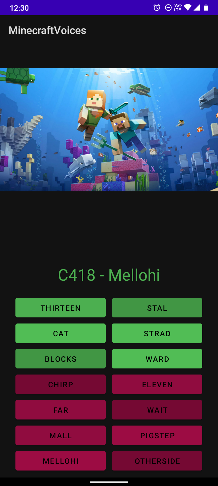

# Minecraft Discs

  

### 🚀 Technologies
- JAVA

### 💻 Project
Android app with all Minecraft discs from beta versions to the latest 1.19.

### 📝 License
This project is under the MIT license. See the [file](LICENSE) for more details.
